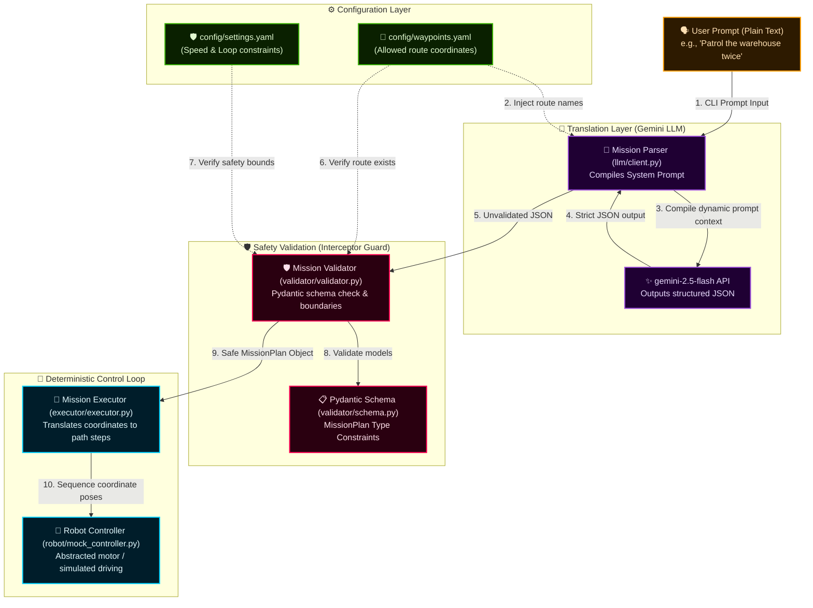

# 🤖 Omokai Robotics: Natural Language Mission Pipeline

[](https://www.python.org/)
[](https://github.com/google/generative-ai-python)
[](https://docs.pydantic.dev/)
[](https://github.com)

A production-quality, modular robotics pipeline that translates natural language instructions into validated, deterministic JSON mission plans and executes them on physical or simulated robots.

---

## ⚡ Interactive Architecture Diagram

For an immersive, high-fidelity view of the system architecture—featuring scrollable zooming, click-to-highlight elements, and a dynamic key—open the interactive documentation page directly:

👉 **[Open Interactive Architecture Panel](file:///Users/shalem/Omokai/docs/architecture.html)**

---

## 🏗️ System Pipeline Architecture

The pipeline processes user commands through a sequential, decoupled chain:



### Core Architecture Stages

1. **Dynamic Context Ingestion (Phase 1)**:
   At script initialization, [main.py](file:///Users/shalem/Omokai/main.py) reads the allowed route keys from [config/waypoints.yaml](file:///Users/shalem/Omokai/config/waypoints.yaml) and feeds them to [MissionParser](file:///Users/shalem/Omokai/llm/client.py#L9). The parser compiles a dynamic [SYSTEM_PROMPT](file:///Users/shalem/Omokai/llm/prompts.py#L1) specifying the exact allowed keys.

2. **Translation & Structured Generation (Phase 2)**:
   The plain-text user command is sent to the Gemini API (`gemini-2.5-flash`) along with the dynamically compiled prompt context, forcing the LLM to choose matching keys (e.g. mapping "warehouse loop" directly to `warehouse_loop`) and output a raw JSON dictionary.

3. **Active Validation Shielding (Phase 3)**:
   Before execution, [MissionValidator](file:///Users/shalem/Omokai/validator/validator.py#L8) catches the raw output. It runs structural validation using [schema.py](file:///Users/shalem/Omokai/validator/schema.py), and checks logical limits defined in [config/settings.yaml](file:///Users/shalem/Omokai/config/settings.yaml) (such as max loops and speed boundaries). If any violations occur, execution is blocked immediately.

4. **Deterministic Motor Loop (Phase 4)**:
   Once validation succeeds, the safe `MissionPlan` is parsed by [MissionExecutor](file:///Users/shalem/Omokai/executor/executor.py#L7). It coordinates step-by-step route poses and navigates the robot via the [BaseRobotController](file:///Users/shalem/Omokai/robot/base.py#L3) interface. Since execution is strictly separated from AI reasoning, running the same output always guarantees the exact same path.

---

## 🛠️ Installation & Setup

### Local Setup
1. Create and activate a virtual environment:
   ```bash
   python3 -m venv .venv
   source .venv/bin/activate
   ```
2. Install the pipeline dependencies:
   ```bash
   pip install -r requirements.txt
   ```
3. Populate your Gemini API Key inside a `.env` file at the root:
   ```env
   GEMINI_API_KEY=your_gemini_api_key_here
   ```

### Docker Setup
To run the pipeline inside a portable container:
```bash
# Build the Docker image
docker build -t omokai-mission-pipeline .

# Run the pipeline locally (forces mock LLM mode by default)
docker run -it omokai-mission-pipeline --prompt "Patrol the warehouse twice at speed 1.2" --mock-llm
```

---

## 🚀 Execution & Usage Examples

Run the pipeline using the entrypoint script [main.py](file:///Users/shalem/Omokai/main.py):

```bash
# Execute a patrol mission using the live Gemini API (reads key from .env)
python main.py --prompt "Patrol the warehouse loop once at speed 1.2"

# Force offline/local simulation mode using local keyword parsing rules
python main.py --prompt "Inspect the perimeter twice" --mock-llm
```

### Try these instructions:
* 🗣️ *"Inspect the perimeter"*
* 🗣️ *"Patrol the warehouse loop twice at speed 1.2"*
* 🗣️ *"Inspect the route and do not return home"* (sets `return_home: false`)

---

## ⚙️ Configuration Schema

Safety boundaries and telemetry velocities are defined in [config/settings.yaml](file:///Users/shalem/Omokai/config/settings.yaml):
```yaml
safety:
  max_speed: 1.5      # Maximum velocity allowed (m/s)
  min_speed: 0.1      # Minimum velocity allowed (m/s)
  max_loops: 10       # Prevents infinite control loops
  default_speed: 0.5  # Fallback speed if prompt is unspecified
```

Coordinates, names, and orientation states are managed in [config/waypoints.yaml](file:///Users/shalem/Omokai/config/waypoints.yaml):
```yaml
routes:
  warehouse_loop:
    - { name: "start", x: 0.0, y: 0.0, theta: 0.0 }
    - { name: "rack_a", x: 5.0, y: 0.0, theta: 0.0 }
  inspection_route:
    - { name: "start", x: 0.0, y: 0.0, theta: 0.0 }
    - { name: "machine_1", x: 2.0, y: 2.0, theta: 0.78 }
```

---

## 📈 Real-World Expansion Model
To adapt this local mock architecture to hard, real-world deployments:
1. **Nav2 Integration**: Replace the Mock controller with a `ROS2Nav2Controller` executing ROS 2 action server callbacks (`navigate_to_pose`).
2. **Multi-Agent Coordination**: Expand the structured JSON output schema to return arrays of missions assigned to specific agent IDs, orchestrating fleets through a Fleet Dispatch module.
3. **Obstacle Navigation (SLAM)**: The executor passes coordinates to a local dynamic path planner (e.g., ROS 2 Costmaps/DWA), delegating local steering to the navigation stack while maintaining overall mission structure.
