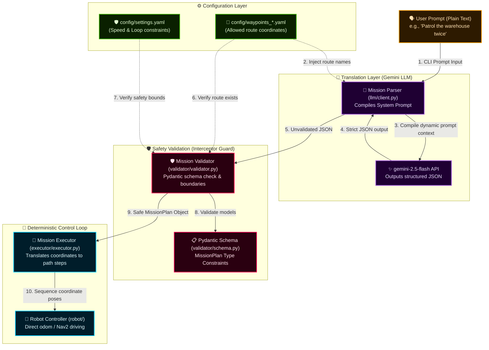

# 🤖 Omokai Robotics: Natural Language Mission Pipeline

A production-quality, modular robotics pipeline that translates natural language instructions into validated, deterministic JSON mission plans and executes them on physical or simulated robots.

This project implements the core task of the Omokai Robotics Engineering Task, demonstrating full support for multiple ground robot platforms in simulation: **TurtleBot3** (using ROS 2 Nav2) and the **e-Yantra Krishi Cobot** (using direct odometry/LiDAR velocity controls).

---

## 🏗️ System Architecture

The pipeline processes user commands through a sequential, decoupled chain:



### Architectural Breakdown

1. **Dynamic Context Ingestion**:
   At initialization, [main.py](file:///home/alex/Documents/Omokai_Project/main.py) reads the selected robot parameter (`--robot`) and loads the corresponding waypoint file (e.g. `config/waypoints_ebot.yaml`). The allowed route keys are extracted and fed to `MissionParser`, which dynamically injects them into the system prompt. This forces the LLM to choose matching keys (e.g., mapping "warehouse" to `warehouse_loop`).
2. **Translation & Structured Generation**:
   The plain-text user command is sent to the Gemini API (`gemini-2.5-flash`) along with the dynamically compiled prompt context, forcing the LLM to output a strict JSON structure matching our schema.
3. **Active Validation Shielding**:
   Before execution, `MissionValidator` catches the raw output. It runs structural validation using Pydantic, and checks logical limits defined in `config/settings.yaml` (such as speed boundaries and loop count). If any violations occur, execution is blocked immediately.
4. **Deterministic Motor Loop**:
   Once validation succeeds, the safe `MissionPlan` is parsed by `MissionExecutor`. It coordinates step-by-step route poses and navigates the robot via the selected controller interface. Since execution is strictly separated from AI reasoning, running the same output always guarantees the exact same path.

---

## 🛠️ Installation & Setup

This repository is designed to be highly portable and run out-of-the-box on the examiner's Linux machine.

### Method A: Local Setup (Recommended)
1. **Create and activate a virtual environment**:
   ```bash
   python3 -m venv .venv
   source .venv/bin/activate
   ```
2. **Install dependencies**:
   ```bash
   pip install -r requirements.txt
   ```
3. **Set your Gemini API Key**:
   Create a `.env` file at the root:
   ```env
   GEMINI_API_KEY=your_gemini_api_key_here
   ```

### Method B: Docker Setup
To run the pipeline inside a portable container:
```bash
# Build the Docker image
docker build -t omokai-mission-pipeline .

# Run the pipeline locally (forces mock LLM and mock Robot mode by default)
docker run -it omokai-mission-pipeline --prompt "Patrol the warehouse twice at speed 1.2" --mock-llm
```

---

## 🚀 Execution & Usage Examples

You can run the pipeline for different robot platforms.

### 1. Mock Mode (Offline Testing)
Verify the LLM parsing and Pydantic validation workflow without launching any simulators:
```bash
python main.py --prompt "Patrol the warehouse loop twice" --robot turtlebot3 --mock-llm
```

### 2. TurtleBot3 Navigation (Gazebo Classic + Nav2)
Requires running the standard TurtleBot3 Nav2 stack (`ros2 launch nav2_bringup tb3_simulation_launch.py`).
```bash
python main.py --prompt "Patrol the warehouse loop once at speed 1.2" --robot turtlebot3 --ros
```

### 3. e-Yantra Krishi Cobot (Ignition Gazebo + Direct Control)
1. Build and source the companion workspace `/home/alex/Documents/eyrc_ws` in your terminal:
   ```bash
   cd /home/alex/Documents/eyrc_ws
   colcon build
   source install/setup.bash
   ```
2. Launch the simulation world:
   ```bash
   ros2 launch eyantra_warehouse task2b.launch.py
   ```
3. Run the Omokai pipeline:
   ```bash
   python main.py --prompt "Patrol the serpentine path at speed 0.4" --robot ebot --ros
   ```

---

## ⚙️ Configuration Files
* **[config/settings.yaml](file:///home/alex/Documents/Omokai_Project/config/settings.yaml)**: Safety boundaries (min/max speeds, loop limits).
* **[config/waypoints_turtlebot3.yaml](file:///home/alex/Documents/Omokai_Project/config/waypoints_turtlebot3.yaml)**: Coordinates for the TurtleBot3 simulation.
* **[config/waypoints_ebot.yaml](file:///home/alex/Documents/Omokai_Project/config/waypoints_ebot.yaml)**: Serpentine and corridor coordinates for the ebot simulation.

---

## 📈 Real-World Scaling Story

To adapt this local mock and simulation architecture to a real-world, high-reliability deployment, we would implement:
1. **Dynamic Path Planning & Local SLAM**: Instead of using direct coordinate waypoints, the executor should send the waypoints to local trajectory planner nodes (e.g. ROS 2 Nav2 DWA or TEB local planners) that utilize active Costmaps. This allows the robot to dynamically steer around unexpected obstacles (such as humans or boxes) in real time while maintaining progress toward the global target.
2. **Deterministic Fail-safe Guardrails**:
   * **LLM Fallback**: If the API call times out or returns malformed JSON, the pipeline immediately falls back to a deterministic regex/keyword parser local module to ensure the robot can still execute safety-critical operations offline.
   * **Telemetry Limits**: The validator continuously monitors state topics. If a velocity exceeding safe bounds is published (due to an LLM hallucination or executor bug), a low-level hardware watchdog node intercepts the message and triggers an emergency stop.
3. **Multi-Agent Coordination (Central Fleet Dispatch)**: Scale the Pydantic JSON schema to accept squad-level actions (e.g. `formation: wedge`). A fleet manager node then allocates sub-waypoints to individual robots using algorithms like Hungarian assignment and orchestrates synchronized execution.

---

## 📚 Cited Sources

This project builds on and references the following open-source resources:
* **Pydantic v2** ([pydantic/pydantic](https://github.com/pydantic/pydantic)) - *License: MIT*. Used to define and validate the structural JSON mission schema.
* **Google GenAI SDK** ([google/generative-ai-python](https://github.com/google/generative-ai-python)) - *License: Apache-2.0*. Used to interface with the Gemini API.
* **ROS 2 Nav2 Simple Commander** ([ros-navigation/navigation2](https://github.com/ros-navigation/navigation2)) - *License: Apache-2.0*. Used as reference for the programmatic interface (`BasicNavigator`) to Nav2.
* **eYRC Krishi Cobot Serpentine Navigation** - *License: Custom/Educational*. The proportional control and LiDAR obstacle avoidance algorithms in `robot/ebot_controller.py` are adapted from the candidate's past work in the e-Yantra Robotics Competition 2025-26.
