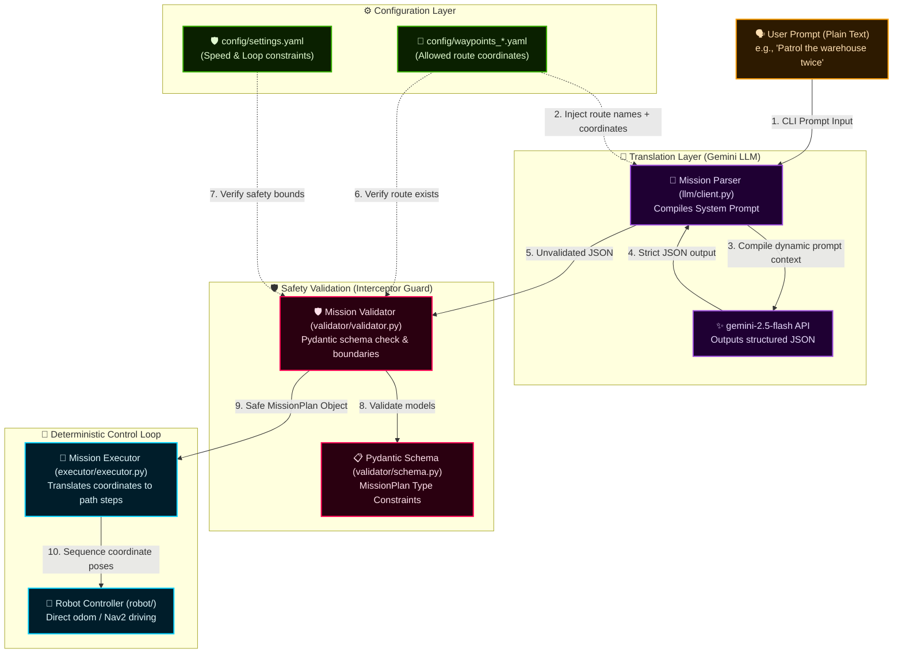

# 🤖 Omokai Robotics: Natural Language Mission Pipeline

A production-quality, modular robotics pipeline that translates natural language instructions into validated, deterministic JSON mission plans and executes them on physical or simulated robots.

This project implements all three senior-level challenges of the Omokai Robotics Engineering Task, demonstrating full support for the **TurtleBot3** (using ROS 2 Nav2).

> **🏆 All 3 Senior Challenges Completed:** Multi-Robot Squad Coordination, SLAM Dynamic Mapping & Navigation, and Vision AI Target Detection & Follow.

---

## 🏗️ System Architecture

The pipeline processes user commands through a sequential, decoupled chain:



### Architectural Breakdown

1. **Dynamic Context Ingestion**:
   At initialization, [main.py](main.py) reads the selected robot parameter (`--robot`) and loads the corresponding waypoint file (e.g. `config/waypoints_turtlebot3.yaml`). All allowed route keys **and** individual named waypoint coordinates are extracted and fed to `MissionParser`. These are dynamically injected into the Gemini system prompt — so named locations like `right_end` are automatically resolved to exact `(x, y, theta)` coordinates by the LLM.
2. **Translation & Structured Generation**:
   The plain-text user command is sent to the Gemini API (`gemini-2.5-flash`) along with the dynamically compiled prompt context, forcing the LLM to output a strict JSON structure matching our schema.
3. **Active Validation Shielding**:
   Before execution, `MissionValidator` catches the raw output. It runs structural validation using Pydantic, and checks logical limits defined in `config/settings.yaml` (such as speed boundaries and loop count). If any violations occur, execution is blocked immediately.
4. **Deterministic Motor Loop**:
   Once validation succeeds, the safe `MissionPlan` is parsed by `MissionExecutor`. Squad missions are intercepted and delegated to `SquadCommander → FormationManager`, while single-robot missions execute step-by-step Nav2 route sequences, followed by optional visual target tracking.

---

## 🛠️ Step-by-Step Setup & Execution Guide

Follow these steps sequentially to set up and run the simulation and controller pipeline.

### Step 1: Clone the Repository
Clone the codebase and navigate to the project directory:
```bash
git clone https://github.com/Alexprinse/Project_O.git
cd Omokai_Project
```

### Step 2: Run the Simulation Host Setup Script
Execute the automated installer to set up ROS 2 Humble, Gazebo, Nav2, all Python dependencies, and build the workspace on Ubuntu 22.04 LTS:
```bash
chmod +x setup_simulation.sh
./setup_simulation.sh
```
*(This script also automatically sets up the Python virtual environment `.venv` with access to ROS system packages).*

### Step 3: Build the Simulation Workspace (Manual Re-compilation)
The setup script compiles the workspace automatically. However, if you modify code in `eyrc_ws` or want to rebuild manually, run:
```bash
cd eyrc_ws
colcon build
cd ..
```

### Step 4: Run the Simulation & Pipeline (Native Host Setup)

To execute the pipeline natively on your host machine:

#### 1. Start the Simulation (Terminal 1)
*   **For TurtleBot3 — Map-Based Navigation (Challenge 1 & 2):**
    ```bash
    export LIBGL_ALWAYS_SOFTWARE=1
    export TURTLEBOT3_MODEL=waffle_pi
    source /usr/share/gazebo/setup.sh
    source /opt/ros/humble/setup.bash

    ros2 launch nav2_bringup tb3_simulation_launch.py \
      world:=/home/alex/Documents/Omokai_Project/config/worlds/warehouse.world \
      map:=/home/alex/Documents/Omokai_Project/config/maps/warehouse_map.yaml \
      params_file:=/home/alex/Documents/Omokai_Project/config/nav2_params.yaml \
      robot_sdf:=/home/alex/Documents/Omokai_Project/config/models/turtlebot3_waffle_pi/model.sdf \
      slam:=False \
      headless:=False
    ```
*   **For TurtleBot3 — SLAM Mode (Challenge 2 Dynamic Mapping):**
    ```bash
    export LIBGL_ALWAYS_SOFTWARE=1
    export TURTLEBOT3_MODEL=waffle_pi
    source /usr/share/gazebo/setup.sh
    source /opt/ros/humble/setup.bash

    ros2 launch nav2_bringup tb3_simulation_launch.py \
      world:=/home/alex/Documents/Omokai_Project/config/worlds/warehouse.world \
      params_file:=/home/alex/Documents/Omokai_Project/config/nav2_params.yaml \
      robot_sdf:=/home/alex/Documents/Omokai_Project/config/models/turtlebot3_waffle_pi/model.sdf \
      slam:=True \
      headless:=False
    ```
*   **For Multi-Robot Squad (Challenge 1 Extended — 2 or 3 Robots):**
    ```bash
    # Terminal 1: Launch the multi-robot simulator
    export LIBGL_ALWAYS_SOFTWARE=1
    export TURTLEBOT3_MODEL=waffle_pi
    source /usr/share/gazebo/setup.sh
    source /opt/ros/humble/setup.bash

    ros2 launch nav2_bringup cloned_multi_tb3_simulation_launch.py \
      world:=/home/alex/Documents/Omokai_Project/config/worlds/warehouse.world \
      map:=/home/alex/Documents/Omokai_Project/config/maps/warehouse_map.yaml \
      params_file:=/home/alex/Documents/Omokai_Project/config/nav2_params.yaml \
      robots:="tb3_0={x: -2.0, y: -0.5, yaw: 0.0}; tb3_1={x: -2.0, y: 0.5, yaw: 0.0}" \
      robot_sdf:=/home/alex/Documents/Omokai_Project/config/models/turtlebot3_waffle_pi/model.sdf \
      autostart:=True
    ```
*   **For Multi-Robot SLAM (Challenge 1 + 2 Combined — SLAM for each robot):**
    ```bash
    # Terminal 1: Launch multi-robot simulator with SLAM enabled
    ros2 launch nav2_bringup cloned_multi_tb3_simulation_launch.py \
      world:=/home/alex/Documents/Omokai_Project/config/worlds/warehouse.world \
      params_file:=/home/alex/Documents/Omokai_Project/config/nav2_params.yaml \
      robots:="tb3_0={x: -2.0, y: -0.5, yaw: 0.0}; tb3_1={x: -2.0, y: 0.5, yaw: 0.0}" \
      robot_sdf:=/home/alex/Documents/Omokai_Project/config/models/turtlebot3_waffle_pi/model.sdf \
      slam:=True \
      autostart:=True

    # Terminal 2: Launch namespaced SLAM toolbox for each robot (fixes TF isolation)
    ros2 launch /home/alex/Documents/Omokai_Project/config/launch/multi_slam_launch.py
    ```

#### 2. Activate Virtual Environment & Export API Key (Terminal 2)
```bash
source .venv/bin/activate
export GEMINI_API_KEY="your_gemini_api_key_here"
```

#### 3. Example Prompts by Challenge

##### 🔵 Challenge 1: Multi-Robot Squad Coordination

*   **Formation Patrol (Wedge / Line / Column):**
    ```bash
    python3 main.py --prompt "robot 1 and robot 2 patrol warehouse_patrol in column formation" --ros --robot turtlebot3
    ```
*   **Split Route Between 2 Robots:**
    ```bash
    python3 main.py --prompt "split the route of warehouse_patrol between robot 1 and robot 2" --ros --robot turtlebot3
    ```
*   **Explicit Zone Assignment (3 Robots):**
    ```bash
    python3 main.py --prompt "robot 1 patrol top_side, robot 2 patrol bottom_side, and robot 3 do delivery" --ros --robot turtlebot3
    ```
*   **Coordinate-Based Multi-Robot Navigation:**
    ```bash
    python3 main.py --prompt "robot 1 go to x=1.92, y=2.20 and robot 2 go to x=1.76, y=-9.43" --ros --robot turtlebot3
    ```
*   **Multi-Robot Regroup at a Point:**
    ```bash
    python3 main.py --prompt "robot 1, robot 2, and robot 3 regroup at x=-3.62, y=-0.06" --ros --robot turtlebot3
    ```

##### 🟢 Challenge 2: SLAM & Autonomous Navigation

*   **Named Waypoint Navigation (auto-resolved to coordinates):**
    ```bash
    python3 main.py --prompt "go to right_end" --ros --robot turtlebot3
    ```
*   **Arbitrary Coordinate Navigation:**
    ```bash
    python3 main.py --prompt "go to x=1.83, y=9.72 and don't return home" --ros --robot turtlebot3
    ```
*   **Multi-Point Coordinate Sequence:**
    ```bash
    python3 main.py --prompt "go to x=1.92, y=2.20 and then go to x=1.76, y=-9.43" --ros --robot turtlebot3
    ```
*   **Route-Based Patrol in SLAM Mode:**
    ```bash
    python3 main.py --prompt "patrol warehouse_patrol" --ros --robot turtlebot3
    ```

##### 🟣 Challenge 3: Vision AI Target Detection & Follow (YOLOv8)

*   **Spawn a target in the warehouse corridor:**
    ```bash
    python3 scripts/swap_object.py --object person --x 1.8 --y 7.0
    ```
*   **Direct target follow:**
    ```bash
    python3 main.py --prompt "find a person and follow it" --ros --robot turtlebot3
    ```
*   **Navigate to a named waypoint first, then follow:**
    ```bash
    python3 main.py --prompt "go to right_end, then search and follow the bottle" --ros --robot turtlebot3
    ```
*   **Navigate to a coordinate first, then follow:**
    ```bash
    python3 main.py --prompt "go to x=1.92, y=2.20, then search and follow the bottle" --ros --robot turtlebot3
    ```
    *(Open RViz, click "Add → Image", and subscribe to `/camera/image_annotated` to view the live camera feed with green bounding boxes!).*

---

### Step 5: Run EVERYTHING inside Docker (with X11 Display Forwarding)

**Highly Recommended:** You can run the entire simulation, ROS 2 Navigation stack, and Python LLM pipeline completely inside Docker. The 3D simulator window (Gazebo/RViz) will be rendered on your host display using X11 forwarding.

👉 **[See the full Docker Setup Guide (docs/docker.md)](docs/docker.md) for complete instructions on building the image, launching the simulation scenarios, and running the controller.**

---

### Step 6: Run in Mock Mode (Zero-Dependency Offline Test)
If you do not have Gazebo or ROS 2 installed and want to run the pipeline offline:

*   **Using Docker (Fastest, requires no local Python packages):**
    ```bash
    docker build -t omokai-mission-pipeline .
    docker run -it --rm omokai-mission-pipeline --prompt "Patrol the warehouse loop twice" --robot turtlebot3 --mock-llm
    ```
*   **Using local Python:**
    ```bash
    source .venv/bin/activate
    python main.py --prompt "Patrol the warehouse loop twice" --robot turtlebot3 --mock-llm
    ```

---

## 🏆 All Senior Challenges Implemented

This repository implements **all three** senior-level challenges:

### 1. Challenge 1: Multi-Robot Squad Coordination ✅

A full multi-robot coordination layer is built on top of the single-robot pipeline, supporting dynamic formation movements, split-route patrols, and rendezvous regrouping for fleets of 2–3 TurtleBot3 robots.

* **Formation Navigation (Wedge / Line / Column)**: Agents assemble into a geometric formation at their current positions using a greedy nearest-slot assignment algorithm to prevent path crossing. During navigation, a 2 Hz Dynamic Offset Re-Planning loop continuously recalculates each follower's target coordinate relative to the leader's live position, keeping the formation tight throughout the route.
* **Implicit Route Splitting**: Given a single shared route (e.g. `warehouse_patrol`), the `split_route_greedy` algorithm partitions waypoints among agents using proximity pairing, minimizing total travel distance and preventing robots from crossing each other's paths.
* **Explicit Zone Assignment**: Each robot can be assigned an independent named route (e.g. robot 1 → `top_side`, robot 2 → `bottom_side`), running fully concurrently with thread-safe parallel execution via `ThreadPoolExecutor`.
* **Coordinate-Based Squad Commands**: The pipeline resolves NL prompts like `"robot 1 go to x=1.92, y=2.20 and robot 2 go to x=1.76, y=-9.43"` into per-robot coordinate waypoints.
* **Regroup at Rendezvous**: All robots autonomously navigate to a shared rendezvous point with staggered collision-avoidance slots arranged in a wedge, using the nearest-slot assignment solver.
* **Key Files**:
  * [`robot/formation/squad_commander.py`](robot/formation/squad_commander.py) — Mission type router
  * [`robot/formation/manager.py`](robot/formation/manager.py) — Formation state machine and 2 Hz tracking loop
  * [`robot/formation/tasks.py`](robot/formation/tasks.py) — Split patrol and regroup executors
  * [`robot/formation/formations.py`](robot/formation/formations.py) — Geometry: slot offsets & world projection

### 2. Challenge 2: SLAM & Autonomous Navigation ✅

The pipeline seamlessly switches between static map-based navigation and dynamic online SLAM mapping without any code changes, auto-detecting the active localization stack at startup.

* **Automatic Localizer Detection**: At boot, the controller polls ROS 2 service names to detect whether `slam_toolbox` or `amcl` is running. It adapts the Nav2 lifecycle wait logic accordingly — bypassing the AMCL blocking check in SLAM mode.
* **Named Waypoint Resolution**: Any named location from `waypoints_turtlebot3.yaml` (e.g. `right_end`, `junction`, `left_end`) mentioned in a natural language prompt is automatically resolved to its exact `(x, y, theta)` coordinates by the LLM at parse time. No manual coordinate lookup needed.
* **Arbitrary Coordinate Navigation**: Users can command the robot to any `(x, y)` coordinate using plain English (e.g. `"go to x=1.5, y=-2.0"`). The LLM extracts the coordinates and the validator checks them against configured safety bounds (`x_min`/`x_max` in `config/settings.yaml`).
* **Stuck Recovery — Recursive Intermediate Waypoints**: If Nav2 returns `FAILED` for a goal (e.g. due to a narrow corridor, inflated costmap, or dynamic obstacle), the controller automatically bisects the path, navigating to an intermediate point 2 m closer before retrying the original goal. This recursion depth is capped at 10 to prevent infinite loops.
* **Namespaced Multi-Robot SLAM**: A custom launch file ([`config/launch/multi_slam_launch.py`](config/launch/multi_slam_launch.py)) starts an independent `slam_toolbox` node per robot with correct TF topic remappings (`/tf` → `tf`, `/tf_static` → `tf_static`), isolating each robot's map to prevent cross-namespace frame contamination.
* **Key Files**:
  * [`robot/ros2_controller.py`](robot/ros2_controller.py) — Nav2 controller with SLAM auto-detection and stuck recovery
  * [`config/launch/multi_slam_launch.py`](config/launch/multi_slam_launch.py) — Namespaced per-robot SLAM launcher
  * [`llm/prompts.py`](llm/prompts.py) — Dynamic context injection of known named waypoints
  * [`config/nav2_params.yaml`](config/nav2_params.yaml) — Namespaced Nav2 parameter overrides

### 3. Challenge 3: Vision AI Target Detection & Follow (YOLOv8) ✅

An end-to-end visual servoing controller integrates YOLOv8 nano deep learning inference directly into the ROS 2 control loop with no external camera middleware required.

* **YOLOv8 Deep Learning Detection**: Uses the `ultralytics` YOLOv8 nano model (fully cached locally, works offline) to detect objects across all 80 COCO classes with configurable confidence thresholds (`0.25` for targeting, `0.15` for debug logging).
* **Label Alias Mapping**: Implements a semantic alias resolver so natural prompts match Gazebo models correctly (e.g. `"beer"` → `cup`/`bottle`, `"tree"` → `potted plant`, `"car"` → `car`/`truck`/`bus`).
* **Proportional Steering Controller**: Adjusts angular velocity proportional to the horizontal pixel offset of the target bounding box center from the image center (`k_ang = 0.003`), with hard clamping at `±0.4 rad/s`. Linear velocity decreases as the bounding box area grows (robot slows as it approaches), stopping automatically when `width_ratio > 0.25`.
* **Lost-Target Recovery Scan**: If the target leaves the camera frame, a frame counter begins. After ~1 second of continuous loss (20 frames), the robot spins slowly in place (`0.3 rad/s`) to scan and re-acquire the target.
* **Live Annotated RViz Feed**: Publishes annotated frames with green bounding boxes and labels to `/camera/image_annotated` for real-time visualization in RViz.
* **Operator Snapshot**: Saves a `detection.jpg` snapshot the moment the target is first acquired in the camera frame.
* **cv_bridge-Free Image Processing**: Converts raw ROS Image bytes to OpenCV BGR matrices manually (`np.frombuffer` + reshape + `cv2.cvtColor`), eliminating the `cv_bridge` dependency entirely.
* **Sequential Navigate-then-Follow**: A single prompt like `"go to right_end, then search and follow the bottle"` executes a full waypoint navigation mission first, then seamlessly hands off control to the visual tracking loop. Named locations are resolved to real coordinates automatically.
* **Key Files**:
  * [`robot/ros2_controller.py`](robot/ros2_controller.py) — `follow_target()` and `_detect_yolo()` methods
  * [`scripts/swap_object.py`](scripts/swap_object.py) — Spawns/swaps target objects in Gazebo

---

## ⚙️ Configuration Files
* **[config/settings.yaml](config/settings.yaml)**: Safety boundaries (min/max speeds, loop limits, coordinate bounds).
* **[config/waypoints_turtlebot3.yaml](config/waypoints_turtlebot3.yaml)**: Named route coordinates for the TurtleBot3 simulation (warehouse patrol, top/bottom side, delivery routes, home pose).
* **[config/nav2_params.yaml](config/nav2_params.yaml)**: Nav2 parameter overrides for namespaced multi-robot configurations.
* **[config/launch/multi_slam_launch.py](config/launch/multi_slam_launch.py)**: Custom launch file for per-robot namespaced SLAM toolbox nodes.

---

## 📈 Real-World Scaling Story

To adapt this local mock and simulation architecture to a real-world, high-reliability deployment, we would implement:
1. **Dynamic Path Planning & Local SLAM**: Instead of using direct coordinate waypoints, the executor should send the waypoints to local trajectory planner nodes (e.g. ROS 2 Nav2 DWA or TEB local planners) that utilize active Costmaps. This allows the robot to dynamically steer around unexpected obstacles (such as humans or boxes) in real time while maintaining progress toward the global target.
2. **Deterministic Fail-safe Guardrails**:
   * **LLM Fallback**: If the API call times out or returns malformed JSON, the pipeline immediately falls back to a deterministic regex/keyword parser local module to ensure the robot can still execute safety-critical operations offline.
   * **Telemetry Limits**: The validator continuously monitors state topics. If a velocity exceeding safe bounds is published (due to an LLM hallucination or executor bug), a low-level hardware watchdog node intercepts the message and triggers an emergency stop.
3. **Multi-Agent Coordination (Central Fleet Dispatch)**: Scale the Pydantic JSON schema to accept squad-level actions (e.g. `formation: wedge`). A fleet manager node then allocates sub-waypoints to individual robots using algorithms like Hungarian assignment and orchestrates synchronized execution.

---

## 📚 Cited Sources

This project builds on and references the following open-source resources:
* **Pydantic v2** ([pydantic/pydantic](https://github.com/pydantic/pydantic)) - *License: MIT*. Used to define and validate the structural JSON mission schema.
* **Google GenAI SDK** ([google/generative-ai-python](https://github.com/google/generative-ai-python)) - *License: Apache-2.0*. Used to interface with the Gemini API.
* **ROS 2 Nav2 Simple Commander** ([ros-navigation/navigation2](https://github.com/ros-navigation/navigation2)) - *License: Apache-2.0*. Used as reference for the programmatic interface (`BasicNavigator`) to Nav2.
* **AWS RoboMaker Small Warehouse World** ([aws-robotics/aws-robomaker-small-warehouse-world](https://github.com/aws-robotics/aws-robomaker-small-warehouse-world)) - *License: Apache-2.0*. Used as the 3D Gazebo warehouse world layout.
* **SLAM Toolbox** ([SteveMacenski/slam_toolbox](https://github.com/SteveMacenski/slam_toolbox)) - *License: LGPL-2.1*. Used for 2D mapping and real-time loop-closure localization.
* **Ultralytics YOLO** ([ultralytics/ultralytics](https://github.com/ultralytics/ultralytics)) - *License: AGPL-3.0*. Used as the object detection and tracking framework for Challenge 3.
* **PyTorch** ([pytorch/pytorch](https://github.com/pytorch/pytorch)) - *License: BSD-3*. Used as the deep learning backend for YOLOv8 model inference.
* **OpenCV** ([opencv/opencv](https://github.com/opencv/opencv)) - *License: Apache-2.0*. Used for matrix operations, drawing bounding boxes, and camera stream conversion.
* **TurtleBot3 Simulations** ([ROBOTIS-GIT/turtlebot3_simulations](https://github.com/ROBOTIS-GIT/turtlebot3_simulations)) - *License: Apache-2.0*. Used as the 3D model and differential-drive control plugins for the TurtleBot3 Waffle Pi robot simulation in Gazebo.
